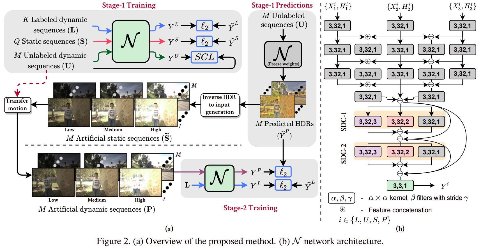

# Few-shot Deep HDR Deghosting
This Repository contains code and pretrained models for our paper: Labeled from Unlabeled: Exploiting Unlabeled Data for Few-shot Deep HDR Deghosting accepted at CVPR, 2021.

It has been tested on RTX 2080Ti with Tensorflow 2.0.0. It also requires MATLAB for optical flow correction related functions.




## Installation and Setup
### Docker Environment:
Getting base image:
```shell script
$ docker pull nvcr.io/nvidia/tensorflow:20.01-tf2-py3
```

Running base image:
```shell script
$ docker run --rm -it nvcr.io/nvidia/tensorflow:20.01-tf2-py3 bash
```

Installing dependencies:
```shell script
(docker)# apt update
(docker)# apt install -y ffmpeg libsm6 libxext6 libxrender-dev
(docker)# pip install opencv-python==4.4.0.42 matplotlib==3.3.1 scikit-image==0.17.2
```

### Dataset Preparation:
1. For Kalantari dataset (SIG17), run the following from the `dataset` folder:
```shell script
wget https://www.robots.ox.ac.uk/~szwu/storage/hdr/kalantari_dataset.zip
unzip kalantari_dataset.zip
python prepare_SIG17.py
rm -rf train test
matlab -nodisplay -nosplash -nodesktop -r "FlowCorrectAndStoreBackFlows('SIG17'); exit;"
```
2. For Prabhakar dataset (ICCP19), from the `dataset` folder,
##### Download ICCP19 Train Set  from https://www.kaggle.com/dataset/558d6f7da370e99824685b50488d9cb86fef812d31d68b9a64ec751b238978a6
##### Download ICCP19 Test Set from https://www.kaggle.com/dataset/a9c5c05e9d5bf0de30009eb0714b461867c8e4a7ebc1288d705644827e27501f
Rename them into ```train.zip``` and ```test.zip```, and then run the following:

```shell script
unzip test.zip
cat *.part* > test.tar
tar -xvf test.tar
python3 prepare_ICCP19.py --src Testing_set/ --dst ICCP19/val

rm -rf *.part*
unzip train.zip
cat *.part* > train.tar
tar -xvf train.tar
python3 prepare_ICCP19.py --src Training_set/ --dst ICCP19/train

rm -rf test.zip *.part*

matlab -nodisplay -nosplash -nodesktop -r "FlowCorrectAndStoreBackFlows('ICCP19'); exit;"
```


## Steps for running different components
1. First, run the docker base image (with all installed dependencies).
2. Download atleast one of the datasets and prepare them, before executing below scripts.
### Training and Artificial Labeled Data Synthesis
1. Refer ```sample_bash_scripts/train_S1.sh``` for Stage 1 training. Significant parameters worth modifying are model, num_static, num_SCL_dynamic, num_supervised_dynamic, dataset, gpu_num, and model_name.

2. Refer ```sample_bash_scripts/predict_synthetic_HDRs.sh``` for generating artificial labeled dataset from Stage 1 trained model. Ensure all parameters are proper and point to correct locations.

3. Refer ```sample_bash_scripts/train_S2.sh``` for Stage 2 training. Significant parameters worth modifying are model, resume_weights_loc, num_synthetic_dynamic, dataset, gpu_num, and model_name.

### Inference
Refer ```sample_bash_scripts/validate.sh``` for validating provided models. Ensure all parameters are proper and point to correct locations.

## Provided Model Weights
For each of zero-shot, one-shot, and five-shot with SIG17 and ICCP19 dataset, we share BridgeNet model weights in ```results```. A script to test all these models is provided at ```sample_bash_scripts/test_provided_models.sh```.

## Citation
When citing this work, you should use the following Bibtex:

    @inproceedings{prabhakar2021labeled,
      title={Labeled from Unlabeled: Exploiting Unlabeled Data for Few-shot Deep HDR Deghosting},
      author={Prabhakar, K Ram and Senthil, Gowtham and Agrawal, Susmit and Babu, R Venkatesh and Gorthi, Rama Krishna Sai S},
      booktitle={Proceedings of the IEEE Conference on Computer Vision and Pattern Recognition},
      year={2021}
    }